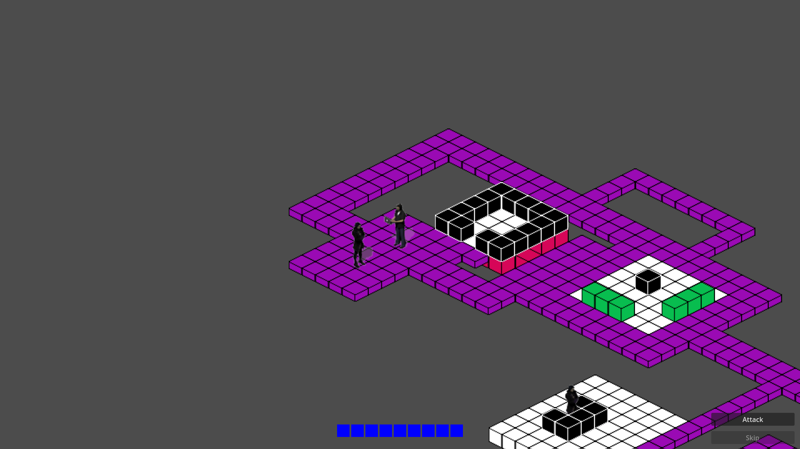
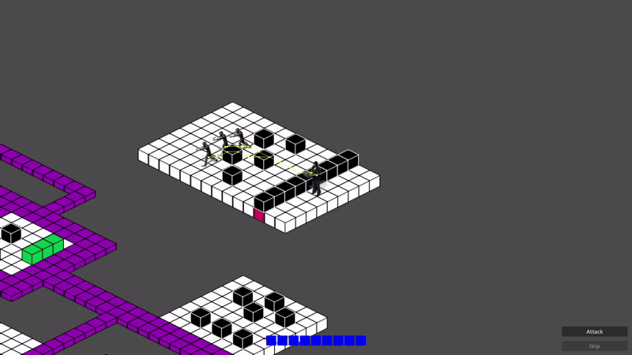
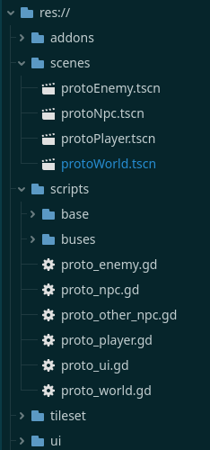

# Godot Project: ProtoCRPG
#
## Info
- **Status**: *WORK IN PROGRESS*
- **Godot** *version: 4.3*
- **Type of game**: *2D (isometric)*
#
#
## Context
ProtoCRPG is a template for building your own CRPG.

Use the latest Godot Engine components, to create a great starting point for an old-school isometric RPG.
#
#
## Features
ProtoCRPG has the following features:
- A fully implemented and working 2D isometric view with multiple layers (**TileMapLayers**) and collisions:

    

 

- Player movement with mouse click using **NavigationAgent2D**:

    

 

- Turn-based combat and movement with *action points* [To finish]:

    

 

- Simple interactions with NPCs:

    

 

- Attack of enemies, with different distances [To finish]:

    

 

- Division of directories and use of Godot conventions 

    

 