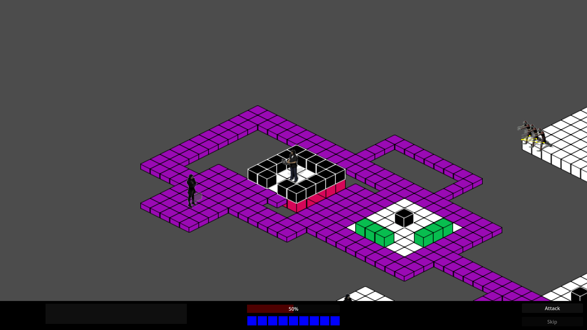
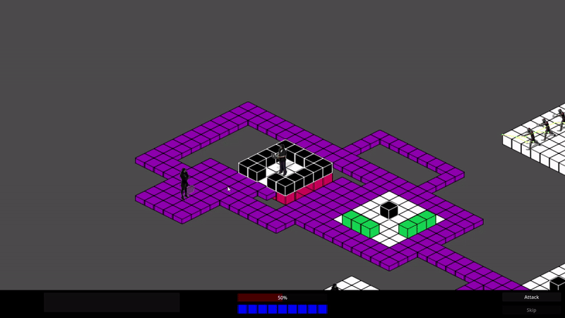
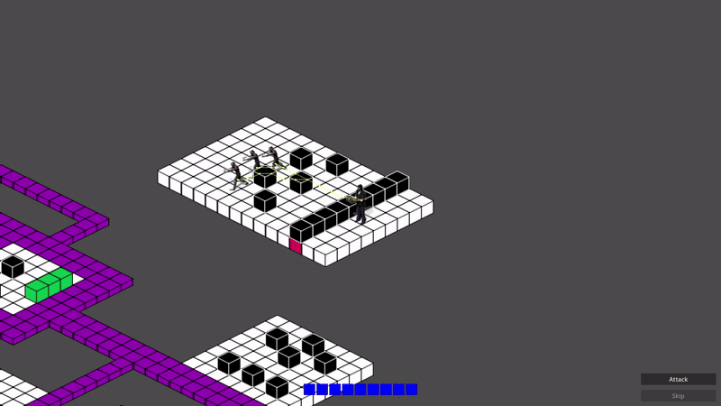
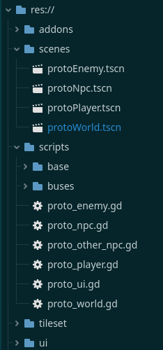

 <h1 align="center">ProtoCRPG</h2>
 
Godot template for building your own CRPG

    
    
    
    
    

    
     
     

<!--- 

 --->

## Context
This template uses the latest Godot Engine components to create a great starting point for creating your own old school isometric RPG.

## Features
ProtoCRPG has the following features:
- A fully implemented and working 2D isometric view with multiple layers (**TileMapLayers**) and collisions:

    

 

- Player movement with mouse click using **NavigationAgent2D**:

    

 

- Turn-based combat, heal and movement with *action points* [To finish]:

    

 

- Simple interactions with NPCs:

    

 

- Log to read/write the results of individual actions:

    

 

- Attack of enemies, with different distances [To finish]:

    

 

- Division of directories and use of Godot conventions 

    

 

## Controls

| Actions                | Keyboard and Mouse |
| ---------------------- | ------------------ |
| Moving                 | Left mouse click   |
| Moving [DEBUG]         | "WASD"             |
| Interaction            | Right mouse click  |
| Attack (on attack mode)| Left mouse click   |
| Heal                   | "Q"                |
| Zoom                   | Mouse scroll       |

### NEXT...
- Bug to fix:
  - Player and enemy behavior, now they get stuck a lot;

- Complete the following functionality:
  - Combat

- Make the template available on:
  - [Asset Library](https://godotengine.org/asset-library/asset)
  - [Awesome Godot](https://github.com/godotengine/awesome-godot?tab=readme-ov-file)